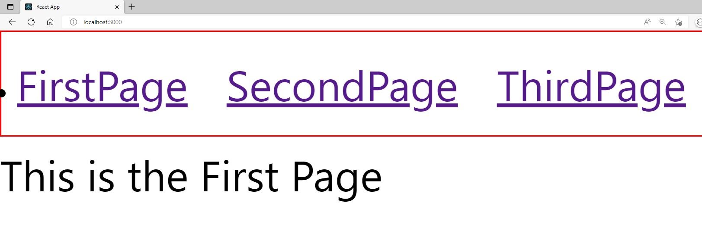
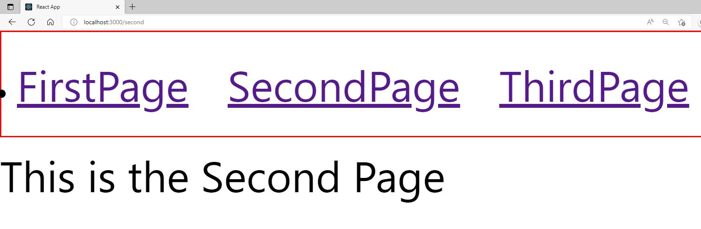
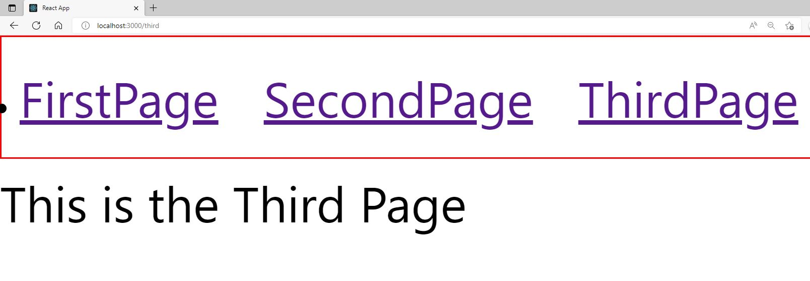

# Understanding-React-Routing
Making a project to really understand routing in React

We use Routing in React so we can give the illusion to the visiting client we got multiple pages they can visit. In reality, when the client clicks another link we never even refresh the page. A good example of this is Netflix. When we go to My List, the page actually updates content, but no refresh. This will enhance the user experience and speed on your pages. Meaning in React, we can use routing to show what's on the page based on the  URL we are using at that point. 

### Installation 

- npm install react-router-dom@5 
- npm install react-router-dom@6


#### VERY IMPORTANT! 

If you wanna use a Switch command to determine your routes USE router-dom@5 since this will not work in dom@6 EXAMPLE BELOW!!!

###router-@dom5
```js
import { Route, Switch } from 'react-router-dom';

import AllMeetupsPage from './pages/AllMeetups';
import NewMeetupPage from './pages/NewMeetup';
import FavoritesPage from './pages/Favorites';

function App() {
  return (
    <div>
      <Switch>
        <Route path='/' exact>
          <AllMeetupsPage />
        </Route>
        <Route path='/new-meetup'>
          <NewMeetupPage />
        </Route>
        <Route path='/favorites'>
          <FavoritesPage />
        </Route>
      </Switch>
    </div>
  );
}

export default App;
```

### router-@dom6
```js
import {
Routes, // instead of "Switch"
Route,
} from "react-router-dom";


import FirstPage from "./pages/FirstPage";
import SecondPage from "./pages/SecondPage";
import ThirdPage from "./pages/ThirdPage";

function App() {

    // Path = localhost:3O00 (when we want to add routing we add a /) localhost:3O00/FirstPage for instance
    // real server later = my-page.com
return <div>
<Routes>
<Route path="/" element={<FirstPage />} />
</Routes>
<Routes>
<Route path="/second" element={<SecondPage />} />
</Routes>
<Routes>
<Route path="/third" element={<ThirdPage />} />
</Routes>

    </div>
;
}
export default App;
```


### Exercise Steps

- First i've made 3 separated pages in a new folder pages
- After creating these pages we need to import the BrowserRouter into our index.js and Wrap it around our App component
- In our App.js we import the Route component from react-router-dom, its job is to define different paths and listen for these paths to know which component he should load.
- Of-course we need to import all the pages as a next step.
- We also need to add the Route component to our div and give it a path={string}
- This wouldn't work! Found out that there is a difference between @dom5 and @dom6 so BE AWARE!
- After this testing in @dom6 all my pages load on different paths.
- Now let's make a MainNavigation Page with all the links in our folder layout
- Instead of using anchor Href link like in html, we can import Link from the React-router-dom. We do this to reduce the HTTP requests because we are already on our React server.
- After adding the LINK we import the MainNavigation into our App.js file.
- We now have links to all of our pages!

First Page


Second Page


Third Page

